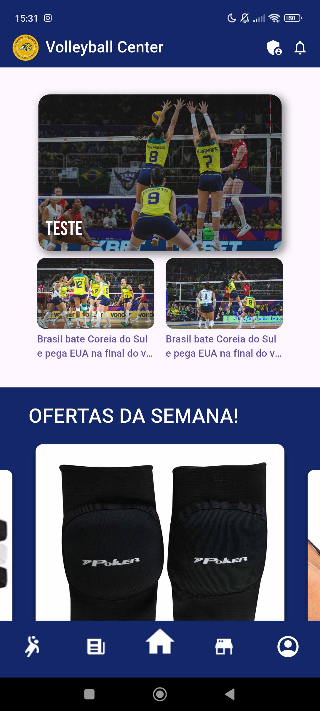
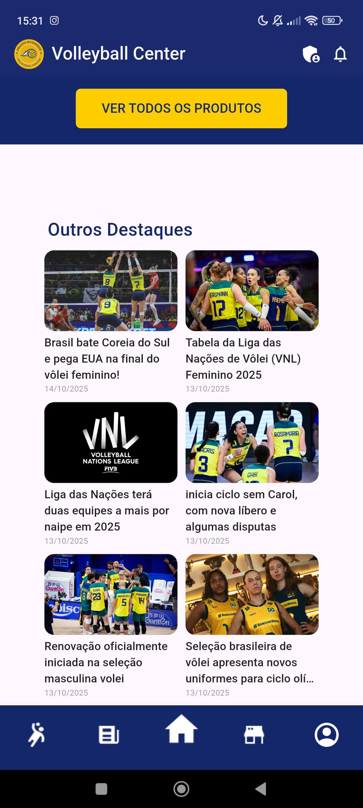
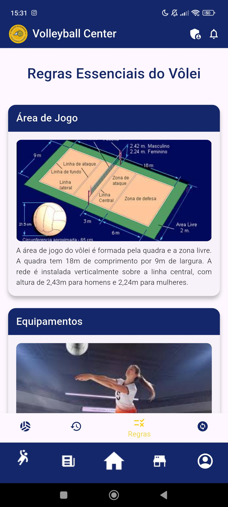
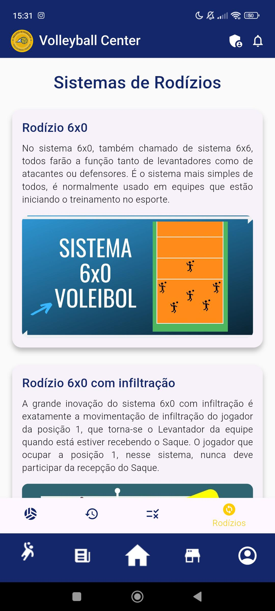
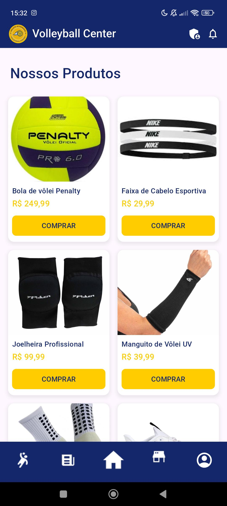
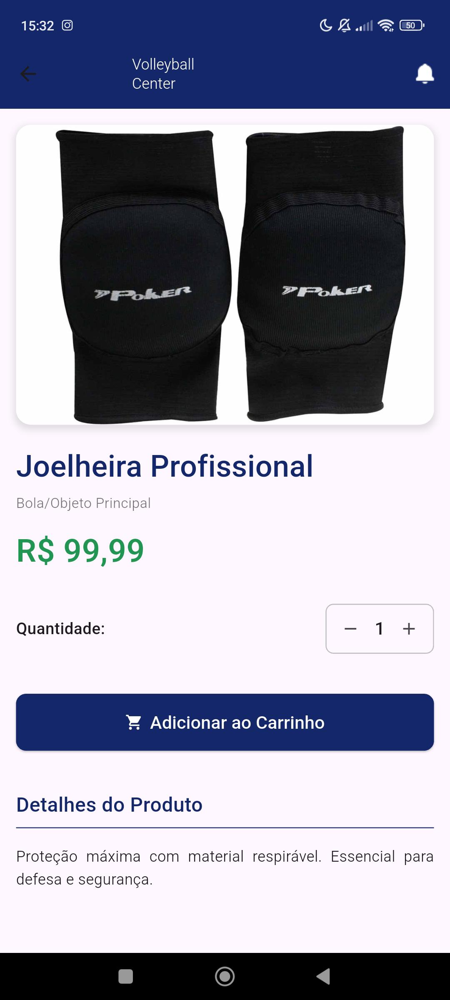
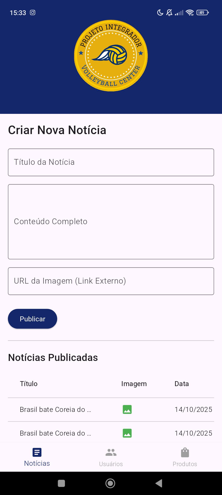
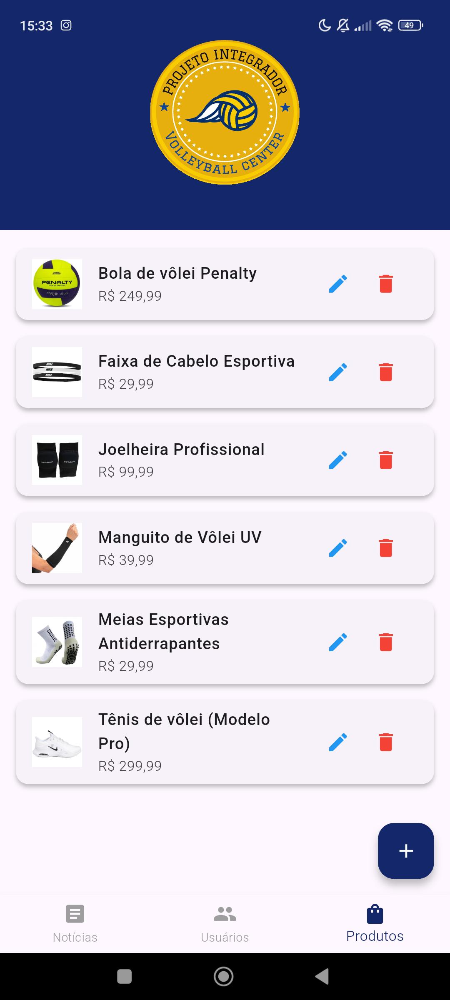

# VOLLEYBALL CENTER MOBILE - Projeto Integrador
## Aplicativo de vôlei construído por um grupo do 3º Ano do Ensino Médio - Sesc/Senac 2025

 
<h2>Objetivo</h2>

Um aplicativo de vôlei feito para a região do Paraná, com dicas para iniciantes, e notícias para os interessados, oferecendo uma melhor experiência para quem deseja aprender mais sobre o esporte e sentir-se mais informado, aprofundando-se no mundo do volêi de uma forma mais dinâmica.

<h2>Feito com: </h2>
<ul>
  <li>FLUTTER</li>
  <li>DART</li>
  <li>FIREBASE</li>
</ul>

<h2>Participantes: </h2>
<ul>
  <li><a href="https://github.com/JayOta">JayOta</a></li>
  <li><a href="https://github.com/anarara">anarara</a></li>
  <li><a href="https://github.com/SaraBeraldo">Sara Beraldo</a></li>
  <li><a href="https://github.com/JMaxGuezzo">Jean Max Guezzo</a></li>
  <li><a href="https://github.com/cpelegrin">Carlos Eduardo Simões Pelegrin</a></li>
  <li><a href="https://github.com/euricoinf">Eurico Junior Tozzo</a></li>
</ul>
 
<h4>Visite também nosso site:</h4> <a target="_blank" href="http://volleyballcenter.infinityfreeapp.com/Routes/index.php">http://volleyballcenter.infinityfreeapp.com</a>
